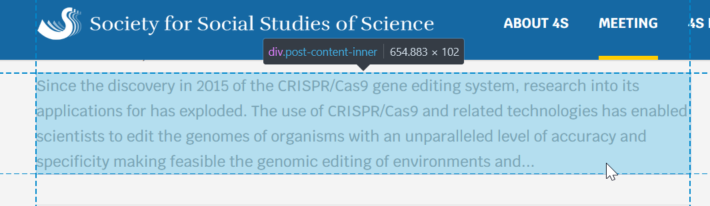
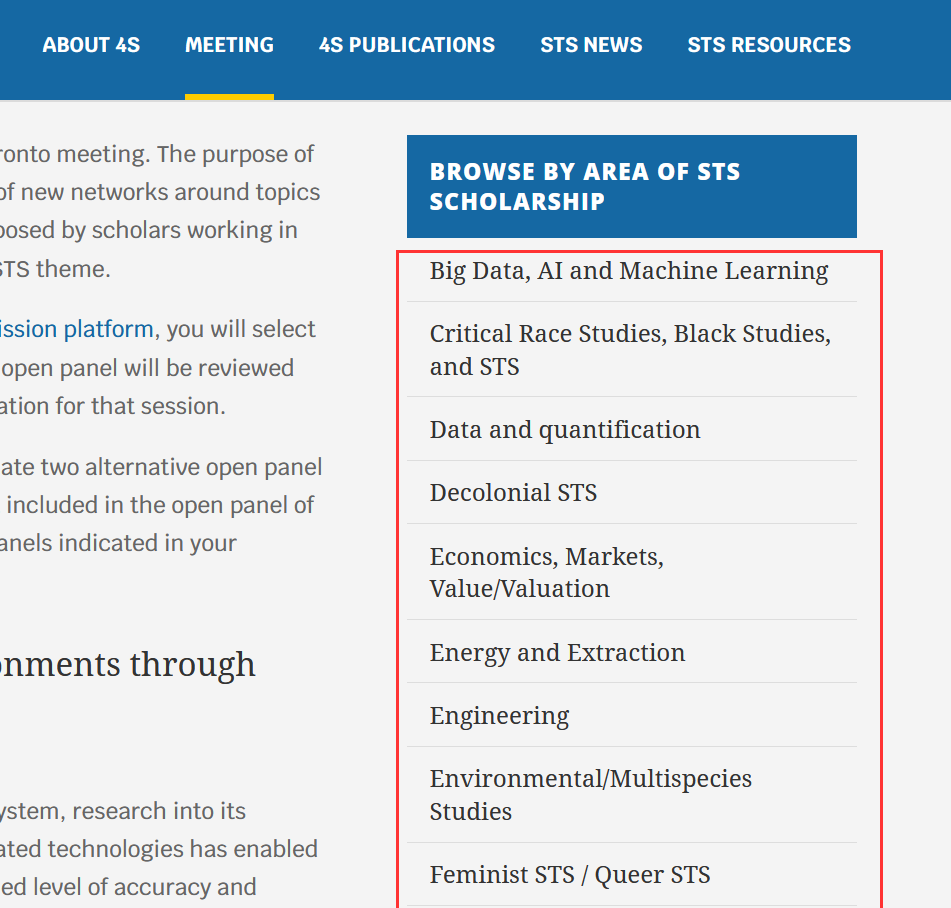

```{r setup, include=FALSE}
knitr::opts_chunk$set(echo = T)
```

I recently went though Julia Silge's great interactive [`tidytext` tutorial](https://juliasilge.shinyapps.io/learntidytext/) to learn some basics of text analysis. Last weekend, my SO was reading through the panel descriptions of the [Society for the Social Studies of Science's (4S) annual meeting](https://www.4sonline.org/meeting/) to figure out which panel to submit an abstract to. There were over 200 panels to choose from, and so this would be a good opportunity to practice some of the techniques I learned.

The `tidytext` tutorial works with data sets that are already nice and clean. For the 4S panels we need to do some web scraping and data cleaning first. The web scraping with `rvest` is also a first for me. The first part of this post will cover the scraping and cleaning. If you want to read about the text analysis, skip ahead to [the second part](#text-mining-ssss-panels).

# Scraping the data {#scraping-the-data}

All panels are listed on this page: <https://www.4sonline.org/meeting/accepted-open-panels/>. We could scrape the panel titles and descriptions right there. Note, however, that the description here is only a snippet, not the full panel description. We'll deal with this later.

Step one is to load the relevant libraries and read in the html page.

```{r}
library(tidyverse)
library(tidytext)
library(rvest)
library(rmarkdown)
```

```{r read-panel}
panel_url <- "https://www.4sonline.org/meeting/accepted-open-panels"
panels <- read_html(panel_url)
panels
```

The next step is to extract the relevant information from that HTML document. If you have a basic understanding of how HTML and CSS work, you could do this by opening the source code of the page in your browser and manually identify the relevant elements.


Here you see that the panel titles are all level 3 headings (`<h3>`) of the class `entry-title`. An easier way to identify the element is by using your browser's element picker. In Firefox, press `F12` and choose the element picker. Then choose the element you want to identify and look at the code in the Inspector window. Here's a screenshot of what this looks like for the panel description:



So the panel description is a `div` of the class `post-inner-content`. (There is a third method to identify relevant content, which we'll use later).

With this information, we're ready to extract panel titles and descriptions:

```{r}

panel_titles <- panels %>% html_nodes(".entry-title") %>% html_text()

panel_desc <- panels %>% html_nodes(".post-content-inner") %>% html_text()

panels_all <- tibble(title = panel_titles, desc = panel_desc)
```

A quick bit of data cleaning to remove the numbers from the titles and use them as an ID column instead:

```{r}
panels_all <- panels_all %>% 
  mutate(id = str_extract(title, "^\\d*"),
         title = str_remove(title, "^\\d+.\\s"))
  
panels_all
```

Looks pretty good, doesn't it? Let's do a simple analysis: What are the most frequent words in the panel titles (after removing common stop words)?

```{r}
panels_all %>% 
  unnest_tokens(word, title, token = "words") %>% 
  anti_join(get_stopwords()) %>% 
  count(word, sort = T)
```

Unsurprisingly, STS has the top spot -- it's the acronym for the whole field: Science and Technology Studies. Before diving deeper into the analysis, let's get the complete descriptions. This requires following the links from the panel titles and scraping those pages. This is a good opportunity to use a third option of identifying elements in an HTML page: Rvest's [Selector Gadget](https://rvest.tidyverse.org/articles/selectorgadget.html). By loading the bookmarklet on the overview page we can identify the URL elements for scraping. We extract the URLs like so:

```{r}
urls <- panels %>% 
  html_nodes("#post-12988 a") %>% 
  html_attr("href") %>% 
  tibble()

tail(urls)
```

The list of URLs is fairly clean, but there are a few irrelevant URLs that slipped through. We'll filter them out with a regular expression.

```{r get-urls}
urls <- urls %>% 
  rename(url = ".")

#filter out irrelevant URLs
urls <- urls %>% 
  filter(str_detect(url, "https://www.4sonline.org/\\d")) %>% 
  pull(url)
```

Now we can get all pages by using `map_df` across all URLs and a custom function to extract the relevant information. Let's develop the function using the first URL. Again using the Selector Gadget, it seems like these should be the relevant elements to extract:

```{r}
page <- read_html(urls[1])

page_2 <- page %>% 
  html_nodes(".et_pb_text_inner , .et_pb_post_content_0_tb_body p, .et_pb_module_header") %>% 
  html_text() 


tibble(
  title = page_2[1],
  organizer = page_2[2],
  posted = page_2[3],
  desc = page_2[4],
  contact = page_2[5],
  keywords = page_2[6]
)
```

Now we can just run the function over the length of the URL vector with [`map_df`](https://purrr.tidyverse.org/reference/map.html). Don't run this yet, though.

```{r eval=FALSE}
pages_full <- map_df(1:length(urls), function(i) {
  page <- read_html(urls[i])

page_2 <- page %>% 
  html_nodes(".et_pb_text_inner , .et_pb_post_content_0_tb_body p, .et_pb_module_header") %>% 
  html_text() 

tibble(
  title = page_2[1],
  organizer = page_2[2],
  posted = page_2[3],
  desc = page_2[4],
  contact = page_2[5],
  keywords = page_2[6]
)
  
}
  )
```

If you ran the code and took a look at the resulting data frame, you'd see that the code breaks for panels that have multiple `<p>` paragraphs in the description. There may be a more elegant fix, but for now we change the code for the `html_elements` to be less specific and not split out individual paragraphs. The downside is that the contact info and keywords get lumped in with the description. We can fix that later.

```{r eval=FALSE}
pages_full <- map_df(1:length(urls), function(i) {
  page <- read_html(urls[i])

page_2 <- page %>% 
  html_nodes(".et_pb_post_content_0_tb_body , .et_pb_text_inner, .et_pb_module_header") %>% 
  html_text() 

tibble(
  title = page_2[1],
  organizer = page_2[2],
  posted = page_2[3],
  desc = page_2[4]
)

  
}
  )
```

As scraping 210 pages takes a long time, we'll save the results as an `rds` file.

```{r eval=FALSE}
write_rds(pages_full, paste0("data/pages_full_", Sys.Date(), ".rds"))
```

Next we'll clean the panel data, including fixing the lumped together panel description, contact info, and keywords. This requires some regular expression magic.

```{r}
pages_full <- read_rds("data/pages_full_2021-03-07.rds")

panels_full_wide <- pages_full %>% 
  separate(organizer, c("organizer_1", "organizer_2", "organizer_3", "organizer_4", "organizer_5", "organizer_6", "organizer_7"), "; ") %>% 
  mutate(id = str_extract(title, "^\\d*"),
         title = str_remove(title, "^\\d*.\\s"),
         keywords = str_extract(desc, "(?<=(Keywords\\:\\s))(.*)"),
         desc = str_extract(desc, "(.|\\n)*(?=\\n\\nContact)")) %>% #return everything before contact
  separate(keywords, c("keyword_1", "keyword_2", "keyword_3", "keyword_4", "keyword_5", "keyword_6", "keyword_7", "keyword_8"), ",|;")

panels_full_wide

```

In addition to the what is contained in the individual panel pages, there are also topic areas/themes for panels:



Getting theme urls and labels is easy:

```{r}
theme_urls <- panels %>% 
  html_elements("#menu-op21 a") %>%
  html_attr("href")

theme_labels <- panels %>% 
  html_elements("#menu-op21 a") %>%
  html_text()
```

We'll download all theme pages to then extract the panel IDs.

```{r}
themes_full <- map_df(1:length(theme_urls), function(i) {
  page <- read_html(theme_urls[i])
theme <- theme_labels[[i]]

page_2 <- page %>% 
  html_nodes(".entry-title") %>% 
  html_text()

tibble(title = page_2, theme) %>% 
  mutate(id = str_extract(title, "^\\d*"),
         title = str_remove(title, "^\\d*.\\s"))
}
)

glimpse(themes_full)
```

We can see that there are 582 observations for 210 panels. So a panel can be listed in more than one theme. Different types of analysis require different data formats, and so we'll create two data frames: For the first one, we want to keep one row per panel. This requires a sequence of `pivot_wider`, `unite`, and `separate` on the themes data before doing a join with the `panels_full_wide` data frame.

```{r}
themes_full_wide <- themes_full %>% 
  pivot_wider(id_cols = c(title, id), names_from = "theme", values_from = theme) %>% 
  unite("theme", 3:26, sep = ";", remove = T, na.rm = T) %>% 
  separate(theme, into = c("theme_1", "theme_2", "theme_3"), sep = ";")

panels_full_wide <- panels_full_wide %>% 
  left_join(themes_full_wide, by = c("id", "title"))
```

With the multiple `keyword_n`, `organizer_n`, and `theme_n` columns, the data does not lend itself to an analysis by these variables. For that, we need to pivot the data to a longer format.

```{r}
panels_full_long <- panels_full_wide %>% 
  pivot_longer(starts_with("organizer_"), names_prefix = "organizer_", names_to = "organizer_order", values_to = "Organizer_name", values_drop_na = T) %>% 
  pivot_longer(starts_with("keyword_"), names_prefix = "keyword_", names_to = "keyword_order", values_to = "keyword", values_drop_na = T) %>% 
  pivot_longer(starts_with("theme_"), names_prefix = "theme_", names_to = "theme_order", values_to = "theme", values_drop_na = T)

glimpse(panels_full_long)
```

That's it for data prep! For your convenience, here are the two data frames:

-   One row per panel (wide format)
    -   [rds](dat04-10-13-44-29.RDS)
    -   [csv](data/panels_full_wide_2021-04-10-13-45-36.csv)
-   multiple rows per panel (long format)
    -   [rds](data/panels_full_long_2021-04-10-13-44-56.RDS)
    -   [csv](data/panels_full_long_2021-04-10-13-45-50.csv)

# Text Mining SSSS panels {#text-mining-ssss-panels}

Let's do some basic text mining on the cleaned panel data. What are the words most commonly used in the panel descriptions, with stop words like "the", "you", "a", ... removed?

## Unigrams, bigrams, trigrams

```{r}
panels_full_wide %>% 
  unnest_tokens(word, desc, token = "words") %>% 
  anti_join(get_stopwords()) %>% 
  count(word, sort = TRUE)
```

Not terribly exciting, is it? Let's do the same but for bigrams.

```{r}
panels_full_wide %>% 
  unnest_tokens(word, desc, token = "ngrams", n = 2) %>% 
  count(word, sort = TRUE)
```

```{r}
bigram <- panels_full_wide %>% 
  unnest_tokens(bigram, desc, token = "ngrams", n = 2)

bigrams_separated <- bigram %>% separate(bigram, c("word1", "word2"), sep = " ")

bigrams_filtered <- bigrams_separated %>% 
    filter(!word1 %in% stop_words$word) %>%
  filter(!word2 %in% stop_words$word)


bigrams_filtered %>% count(word1, word2, sort = TRUE) %>% 
  paged_table()
```

Much better? If two is better than one, is three better than two? Let's try trigrams, without stop word filtering.

```{r}
panels_full_wide %>% 
  unnest_tokens(word, desc, token = "ngrams", n = 3) %>% 
  count(word, sort = TRUE)
```

This does still have a lot of not-so-meaningful rows, and we'll see what happens if we filter for stop words:

```{r}
trigram <- panels_full_wide %>% 
  unnest_tokens(trigram, desc, token = "ngrams", n = 3)

trigrams_separated <- trigram %>% separate(trigram, c("word1", "word2", "word3"), sep = " ")

trigrams_filtered <- trigrams_separated %>% 
    filter(!word1 %in% stop_words$word) %>%
  filter(!word2 %in% stop_words$word) %>% 
  filter(!word3 %in% stop_words$word)

trigrams_filtered %>% 
  count(word1, word2, word3, sort = T) %>% 
  paged_table()


```

For trigrams, filtering for stop words is tricky. The filtered analysis has fewer irrelevant trigrams such as "in order to" or "as well as," but it also filters out meaningful phrases like "the global south" that otherwise would feature prominently.

## Term frequency--inverse document frequency

Going further than just counting words and ngrams, we can look at their relevance in comparison to the whole of all panel descriptions. This addresses the issue that terms like "science and technology" or "this open panel" are going to feature in a large number of panel descriptions and therefore don't add a lot of information. To do this, we look at the term frequency--inverse document frequency (tf-idf), "a numerical statistic that is intended to reflect how important a word is to a document in a collection or corpus."[@tfidf2021a] The `tidytext` package has the convenient `bind_tf_idf()` function for this:

```{r}
panels_full_wide %>% 
  unnest_tokens(word, desc, token = "words") %>% 
  count(word, id) %>% 
  bind_tf_idf(word, id, n) %>%
  left_join(panels_full_wide, by = "id") %>% 
  select(word, n, tf_idf, title) %>% 
  arrange(-tf_idf) %>% 
  paged_table()
```

We can do the same analysis but group the panels by theme to identify distinctive trigrams for each of the themes. This is where the long format of the panel data is needed. We won't filter the trigrams for stop words here, as the tf-idf function will by itself get rid of phrases such as "as well as" or "this open panel".

```{r layout="l-body-outset"}
panels_full_long %>% 
  unnest_tokens(word, desc, token = "ngrams") %>% 
  group_by(theme) %>% 
  count(word, id) %>% 
  bind_tf_idf(word, id, n) %>%
  select(theme, word, n, tf_idf) %>% 
  arrange(-tf_idf) %>% 
  paged_table()
```

# Visualizations

Tables are nice, but graphs are great too. Let's create a network graph of the most common bigrams, using the `igraph` and `ggraph` packages.

```{r}
library(igraph)
library(ggraph)
bigram_count <- bigrams_filtered %>% count(word1, word2, sort = TRUE)


bigram_graph <- bigram_count %>%
  filter(n > 8) %>%
  graph_from_data_frame()

a <- grid::arrow(type = "closed", length = unit(.10, "inches"))

ggraph(bigram_graph, layout = "fr") +
  geom_edge_link(aes(edge_alpha = n), show.legend = FALSE,
                 arrow = a, end_cap = circle(.05, 'inches')) +
  geom_node_point(color = "lightblue", size = 5) +
  geom_node_text(aes(label = name), vjust = 1, hjust = 1) +
  theme_void()
```

And let's end on the OG of text visualizations: the word cloud (or in this case: the bigram cloud). To make it pretty, we filtered for a number of manually defined stop words such as "sts," "panel", or "university press."

```{r layout="l-body-outset", preview = TRUE}
library(wordcloud)
custom_stop_words <- c("panel",
                       "panels",
                       "sts",
                       "paper",
                       "papers",
                       "mit",
                       "press")
custom_stop_bigrams <- c("university press",
                       "conference theme",
                       "durham duke",
                       "duke university",
                       "encourage papers",
                       "science technology",
                       "science studies",
                       "social studies",
                       "technology studies")

bigrams_filtered %>% 
  filter(!word1 %in% custom_stop_words) %>% 
  filter(!word2 %in% custom_stop_words) %>% 
  mutate(word = paste(word1, word2)) %>% 
  filter(!word %in% custom_stop_bigrams) %>% 
  count(word, sort = T) %>% 
  with(wordcloud(word, n, max.words = 25, scale = c(2.5, .5),random.order = FALSE, colors = brewer.pal(8,"Dark2")))
```
